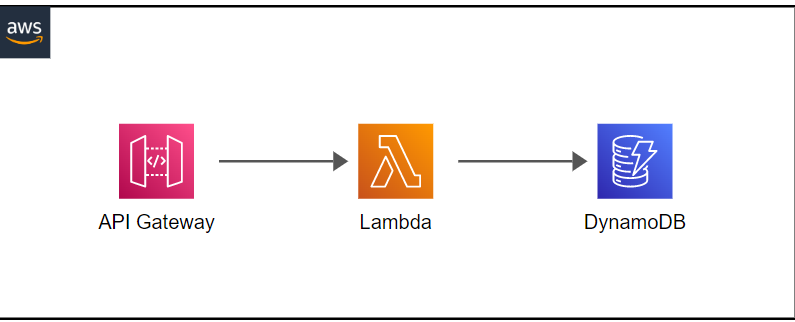

# SAM Demo Udea

In this demo we are setting up the following infrastructure



Where:

* Lambda is where the code is hosted
* API Gateway is the endpoint to the outside public world
* DynamoDB is a document database


## Run load testing

```locust -f locust.py```

open http://localhost:8089 and start the test